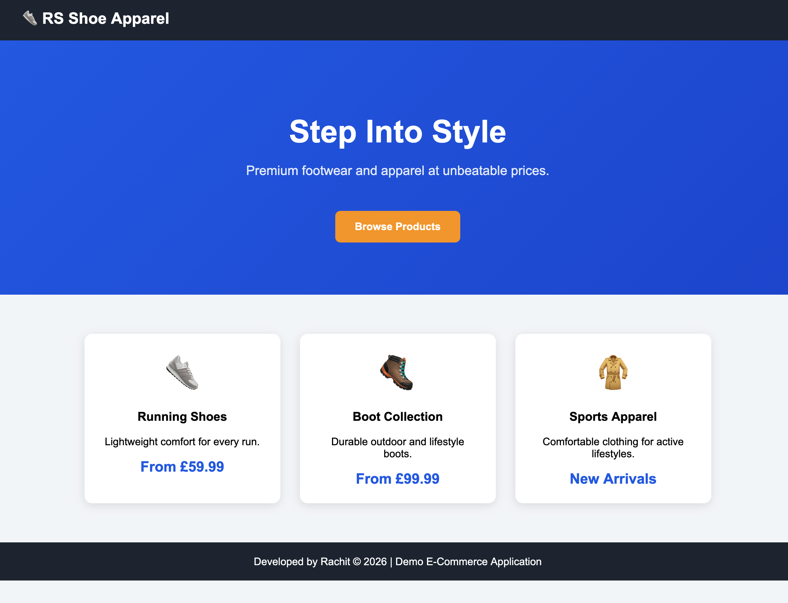
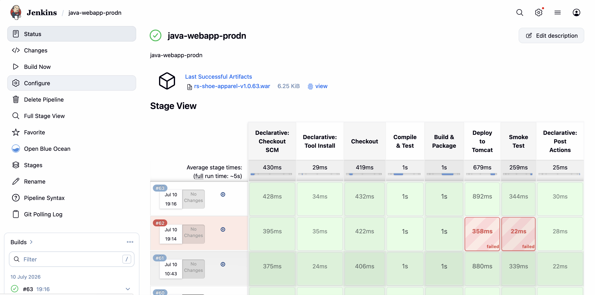
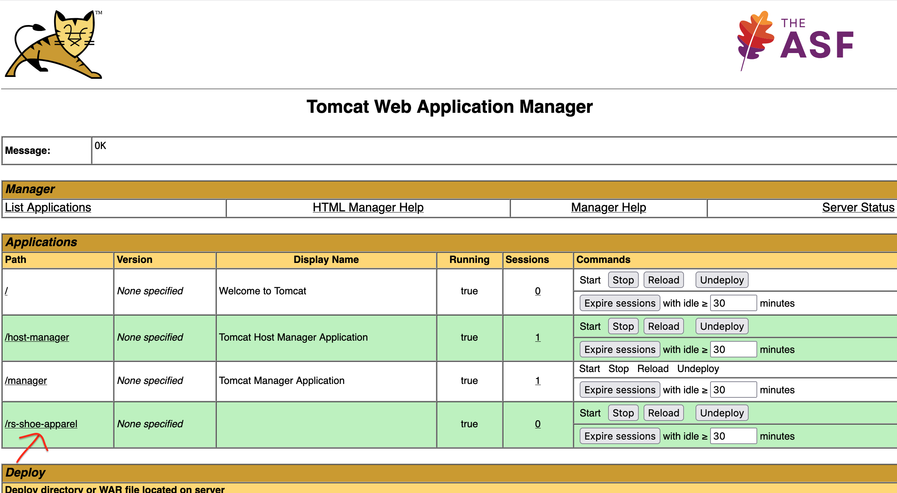
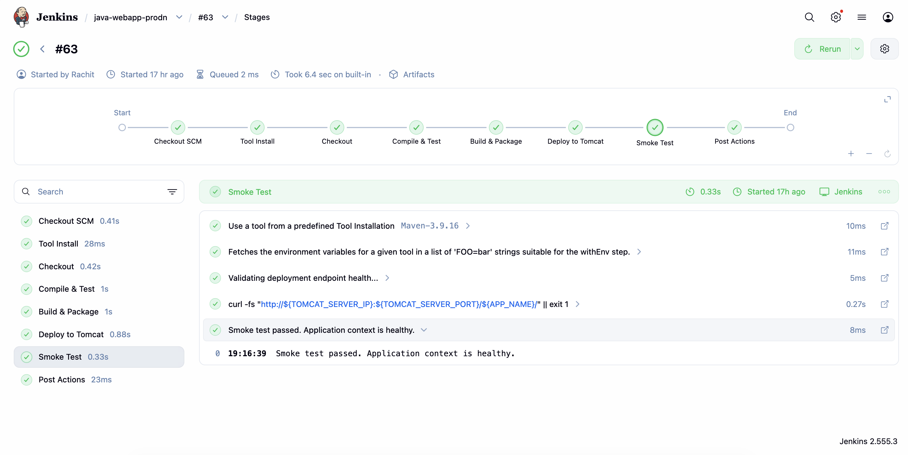

# Java WebApp with Automated CI/CD

A lightweight Java Servlet/JSP web application packaged as a WAR file for deployment to Apache Tomcat.

This repository demonstrates a Maven-based Java web application with a Jenkins CI/CD pipeline that automates build, testing, deployment, and post-deployment validation.




## Project Structure

```plaintext
.
├── Jenkinsfile
├── README.md
├── images
│   ├── tomcat-server.png
│   └── webapp.png
├── pom.xml
└── src
    └── main
        ├── java
        │   └── com
        │       └── rsstore
        │           ├── model
        │           │   └── Product.java
        │           └── servlet
        │               ├── CartServlet.java
        │               └── ProductServlet.java
        └── webapp
            ├── WEB-INF
            │   └── web.xml
            ├── cart.jsp
            ├── index.jsp
            └── products.jsp
```

## Prerequisites

* Java JDK
* Apache Maven 3.x
* Apache Tomcat 9+ (with Manager API enabled)
* Jenkins Server
* Jenkins Agent (optional, but recommended)

## Manual Build and Deploy

### Build Locally

Build the WAR package:

```bash
mvn clean package
```

Output:

```plaintext
target/rs-shoe-apparel.war
```

### Manual Deployment

> [!Important]
> Manual deployment via SCP requires SSH access and appropriate permissions on the target Tomcat server. Alternatively, use `rsync` to reduce security overheads.

Copy the WAR file to the Tomcat server:

```bash
scp target/rs-shoe-apparel.war \
tomcat@<server-ip>:/path/to/apache-tomcat/webapps/
```

Restart Tomcat:

```bash
sudo systemctl restart tomcat
```

If you're unsure of the Tomcat service name:

```bash
systemctl list-units --type=service | grep -i tomcat
```

## CI/CD Pipeline

This repository includes a Jenkins Declarative Pipeline that automates the software delivery process.



### Pipeline Workflow

```plaintext
Checkout
    ↓
Compile & Test
    ↓
Build & Package
    ↓
Archive Versioned Artifact
    ↓
Deploy to Tomcat
    ↓
Smoke Test
```

### Features

* Source code checkout from GitHub
* Maven-based compilation and testing
* WAR packaging
* Versioned build artifacts using Jenkins build numbers
* Artifact archival and fingerprinting
* Deployment through Tomcat Manager API
* Post-deployment smoke testing
* Jenkins credential management
* Build retention policy

### Versioned Artifacts

Each successful build generates a uniquely versioned WAR file:

```plaintext
rs-shoe-apparel-v1.0.68.war
rs-shoe-apparel-v1.0.69.war
rs-shoe-apparel-v1.0.70.war
```

These artifacts are archived in Jenkins to provide build traceability and support future rollback scenarios.

## Verify Deployment

After deployment, verify:

- The application is accessible through Tomcat.
- The deployment completed successfully in Jenkins.





Example URL:

```plaintext
http://<server-ip>:<tomcat-port>/rs-shoe-apparel
```

## Clean Build Artifacts

Remove locally generated build artifacts:

```bash
mvn clean
```